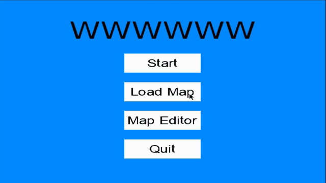
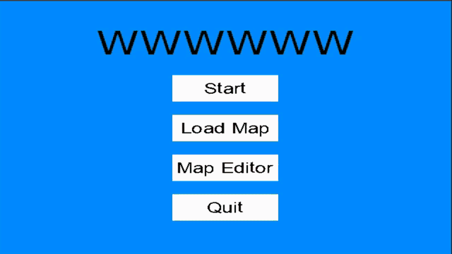

# WWWWWW
Platforming game inspired by [VVVVVV](https://en.wikipedia.org/wiki/VVVVVV) created in C++ with [SDL](https://www.libsdl.org/).  
The objective is to reach the goal by changing the gravity and avoiding the spikes on the way.

The game includes a map editor that can be used to create maps and save/load them in a supported XML format.

## Gameplay

## Map Editor

